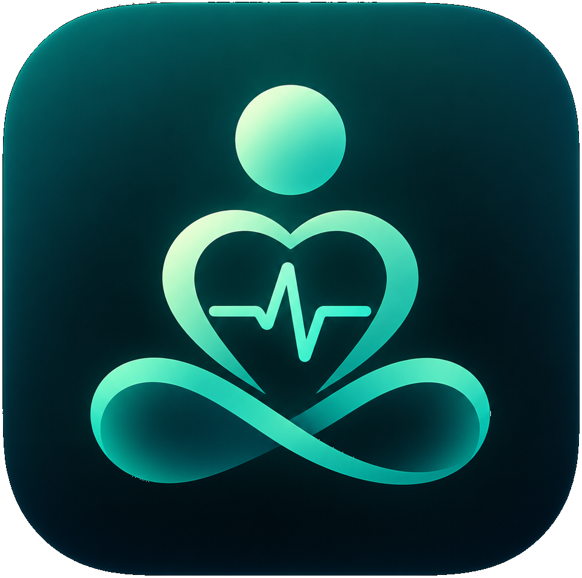
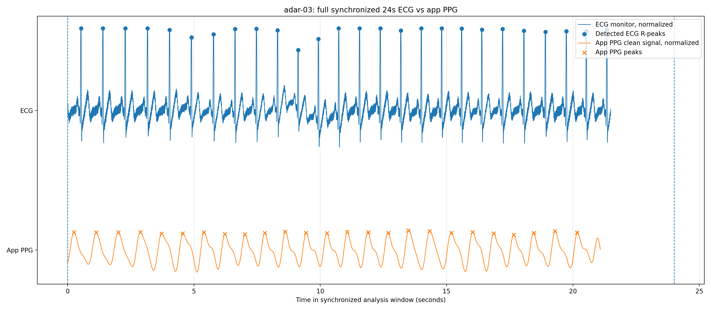
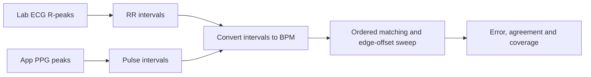
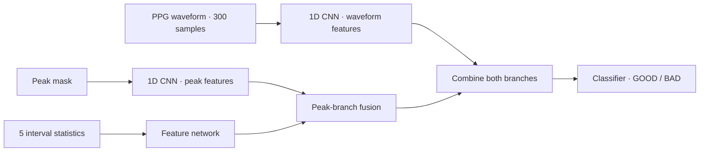
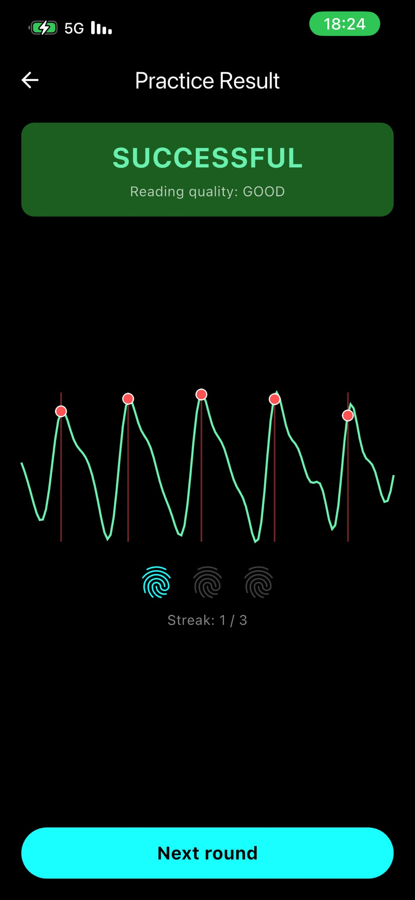
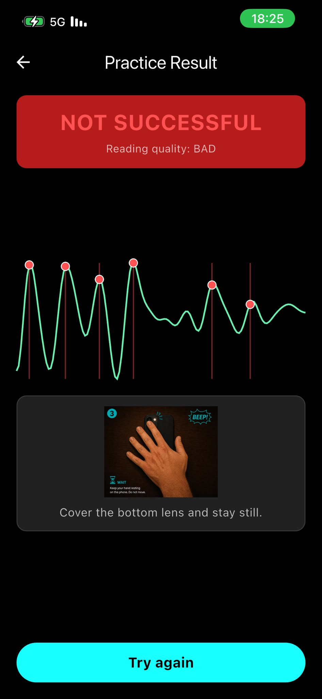
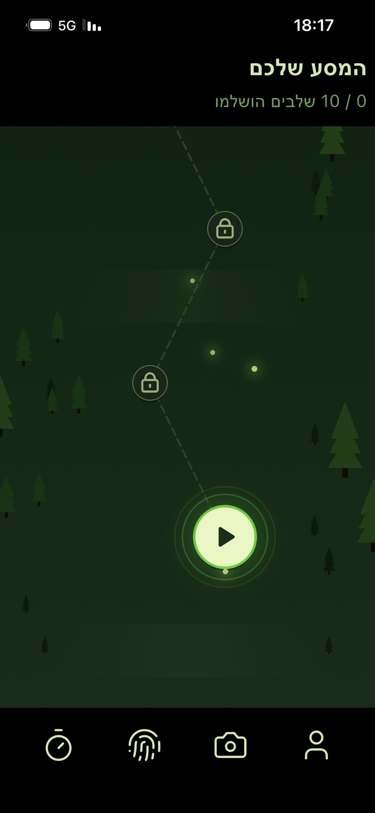
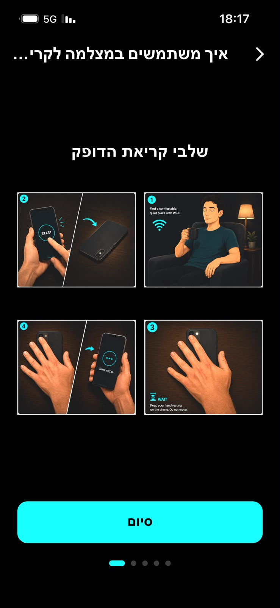
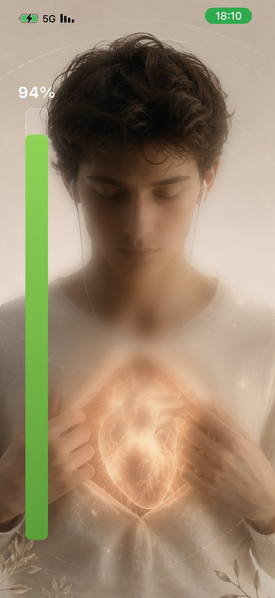
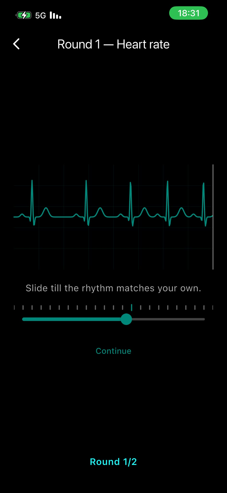

  
  <h1>Heart Monitor</h1>
  
<strong>A mobile research platform for interoceptive training</strong>

  
Python · Flask · OpenCV · PyTorch · Azure SQL · Flutter

## Built for research

Developed in cooperation with **Brain Lab at Reichman University**, Heart Monitor supports an experiment investigating whether training awareness of internal bodily signals—**interoception**—can contribute to chronic-pain treatment.

The platform brings camera-based pulse measurement, machine-learning quality assessment, and guided heartbeat-perception exercises into a structured participant experience, with experimental and control training flows.

## Backend · From fingertip video to pulse measurement

The backend converts subtle changes in fingertip colour into a photoplethysmography (**PPG**) signal. OpenCV extracts the signal from camera frames; filtering and peak detection recover the pulse rhythm. The Flask API returns the waveform, detected beats, and recording quality, while Azure SQL stores study records.

### Comparison against the lab’s ECG monitor

Pulse detection was evaluated against an ECG monitor in the lab using synchronized recordings. The comparison below shows the reference ECG R-peaks alongside the app’s detected PPG peaks.

*Example lab recording. The traces are normalized and vertically separated for visibility.*

The validation script aligns recording timestamps, derives heart rate from consecutive peaks (**BPM = 60 / interval in seconds**), and matches the interval sequences in order. It reports error, agreement, and coverage, including penalties for unmatched intervals.

[Comparison method and calculations →](docs/validation/README.md)

### Machine learning · Quality before feedback

Reliable recordings are essential for meaningful practice: distorted signals can turn measurement error into misleading participant feedback. A custom **two-branch PyTorch neural network** evaluates ten-second windows using both waveform shape and peak timing, helping identify recordings that need to be repeated.

The model was developed with **2,592 labeled PPG segments from BUT PPG and BIDMC**, including 1,835 training segments. The bundled checkpoint achieved **95.3% accuracy and 0.971 F1** for the good-quality class on 379 test segments. These are internal segment-level results; recordings can contribute different segments to training and testing, so they do not establish performance on unseen participants. [Evaluation details →](docs/validation/README.md#signal-quality-model)

  
  &nbsp;&nbsp;
  

## Frontend · A guided participant experience

The **Flutter app for iOS and Android** guides participants from camera preparation through assessment, heartbeat counting, and rhythm matching. English and Hebrew interfaces, right-to-left layouts, voice guidance, and timed counting cues support use while the phone is face down.

A visual progress trail structures the study into an initial assessment, eight training sessions, and a final assessment. Clear feedback and optional reminders support continued participation. The experience was reviewed through **QA by Human–Computer Interaction master’s students**, informing refinements to instructions, navigation, and visual consistency.

  
  
  
  

## Explore the project

[Backend](backend/README.md) · [Frontend](frontend/README.md) · [Study protocol](frontend/docs/protocol.md) · [Device verification](frontend/docs/android-preparation.md)

Both **backend and frontend development histories are preserved** in this presentation repository. [Repository scope and history →](docs/snapshot.md)
