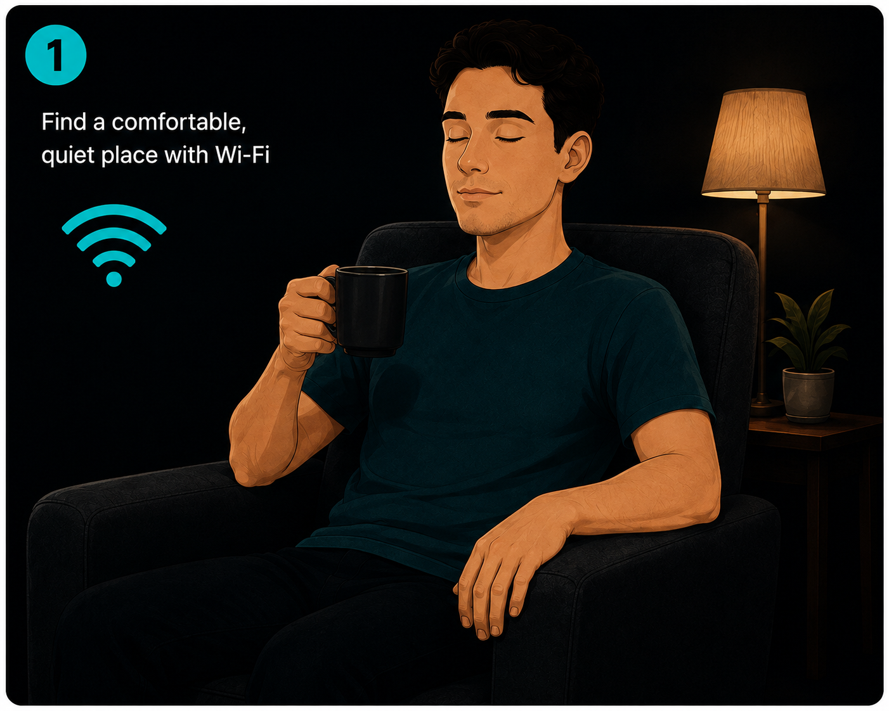
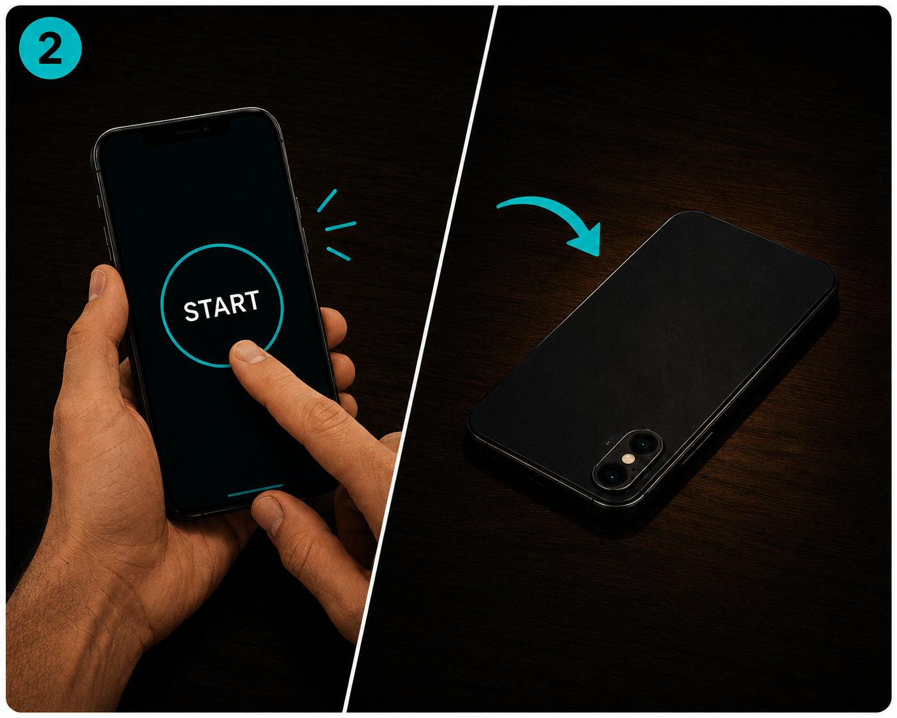
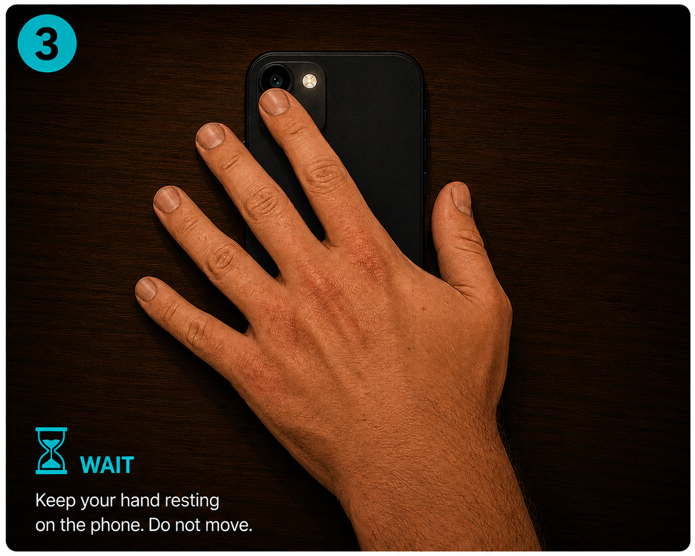
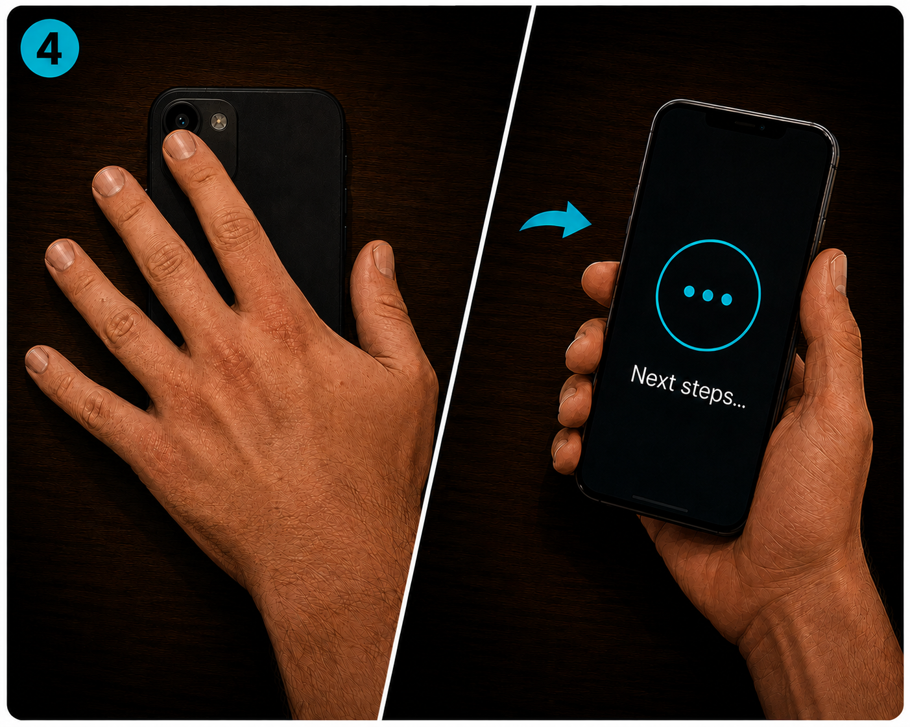
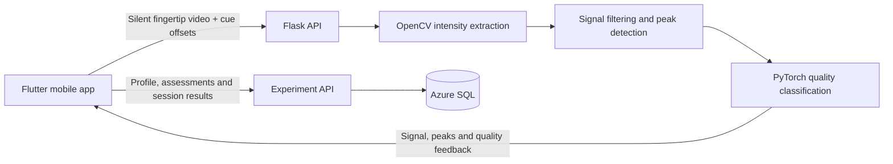

<div align="center">
  
  <h1>Heart Monitor</h1>
  <p>A bilingual mobile app for heartbeat-perception practice, with camera-based pulse analysis.</p>
  <p><strong>Flutter · Python / Flask · OpenCV · PyTorch · Azure SQL</strong></p>
</div>

## About the project

Heart Monitor guides participants through pulse-recording preparation, assessments, and a sequence of practice sessions. Participants use a phone's rear camera and flash to record their fingertip. The backend extracts a photoplethysmography (PPG) signal, detects pulse peaks, and classifies recording quality with a neural network.

The app supports English and Hebrew, including right-to-left layouts and recorded voice guidance. It includes regular training using the participant's pulse and control training using generated audio rhythms.

This repository brings the mobile frontend and backend together for presentation and code review. It is a snapshot of the working projects, including current local development changes. It has no deployment workflow and does not replace the repositories connected to the live Azure deployment. Both original development histories are preserved as imported ancestry, with their files relocated under `frontend/` and `backend/`. Import merges retain the current consolidated presentation snapshot. Authors, dates, and messages are preserved; commit IDs differ because paths and sensitive-file history were rewritten.

## Participant experience

1. Choose a language and complete the preparation steps: profile, questionnaire step, camera identification, and pulse-recording practice.
2. Complete the initial assessment.
3. Follow the ten-step trail: initial assessment, eight training sessions, and final assessment.
4. Review feedback on counted versus measured/generated beats, counting accuracy, and rhythm matching.
5. Set optional local reminders for upcoming sessions.

The regular and control training rounds independently choose a net duration between 20 and 40 seconds. Recording preparation and buffers are additional; assessment and preparation steps have their own timings. During external QA, the training group is selected in Profile rather than randomly assigned.

<details>
<summary>Camera tutorial illustrations</summary>
<p>These are the in-app instruction assets, not screenshots of the current interface.</p>
<p>
  
  
</p>
<p>
  
  
</p>
</details>

## How it works



The video endpoint uses a unique temporary file for each request and cleans it up afterward. Analysis results are returned to the requesting client; uploaded videos are not retained in SQL. Experiment records are scoped to an installation identifier and trial ownership checks. Installation identity is not account-based authentication.

The quality model evaluates approximately ten-second signal windows. Counting cues carry their offsets to the backend so scoring uses the intended counting interval. Audible output and native camera latency still require device verification; timing is not a claim of sample-accurate synchronization.

## Explore the code

- [Frontend](frontend/README.md): Flutter screens, localization, recording, guidance, reminders and study flow.
- [Backend](backend/README.md): Flask routes, PPG processing, quality classification and persistence.
- [Frontend module guide](frontend/lib/README.md)
- [Study protocol](frontend/docs/protocol.md)
- [Database schema and API setup](backend/docs/experiment-db.md)
- [Android builds and device checklist](frontend/docs/android-preparation.md)
- [Snapshot scope](docs/snapshot.md)

## Run locally

### Backend

Use Python with compatible wheels for the dependencies in `requirements.txt`:

```sh
cd backend
python3 -m venv .venv
source .venv/bin/activate
python -m pip install -r requirements.txt
python server.py
```

The development API listens on port 5000. `GET /health` reports service availability. The quality checkpoint is included at `backend/models/ppg_quality_both.pt`.

Persistence requires Azure SQL, ODBC Driver 18, and the environment variables described in the [database guide](backend/docs/experiment-db.md). Health and video-analysis routes can run without SQL configuration. Do not put database passwords in source control.

### Mobile app

Install Flutter and the platform toolchain (Xcode/CocoaPods for iOS; Android SDK/JDK for Android):

```sh
cd frontend
flutter pub get
flutter run --dart-define=BACKEND_URL=https://YOUR_BACKEND_HOST
```

`BACKEND_URL` is a build-time setting shared by video uploads and experiment requests. This presentation copy defaults to a placeholder host, not the live study deployment. Use a phone-accessible HTTPS endpoint for physical-device testing; `localhost` on a phone is the phone itself.

An Android APK can be installed privately without Google Play. Release signing keys are intentionally absent; follow the [Android guide](frontend/docs/android-preparation.md) to generate your own.

## Verification and readiness

```sh
# From frontend/
flutter analyze --no-fatal-infos
flutter test

# From backend/, with its dependencies installed
python -m unittest discover -s tests
python test_ppg_classifier.py
```

The frontend test suite passed all 67 tests again in this standalone repository. The working frontend also previously produced a signed Android release APK and an unsigned iOS build. This snapshot does not include those binaries or the signing key. Android camera behavior, audible cue timing, sound-state handling, and notifications still need physical-device testing. A successful build does not establish clinical accuracy or production capacity.

This is a research/practice application, not a validated diagnostic medical device.
